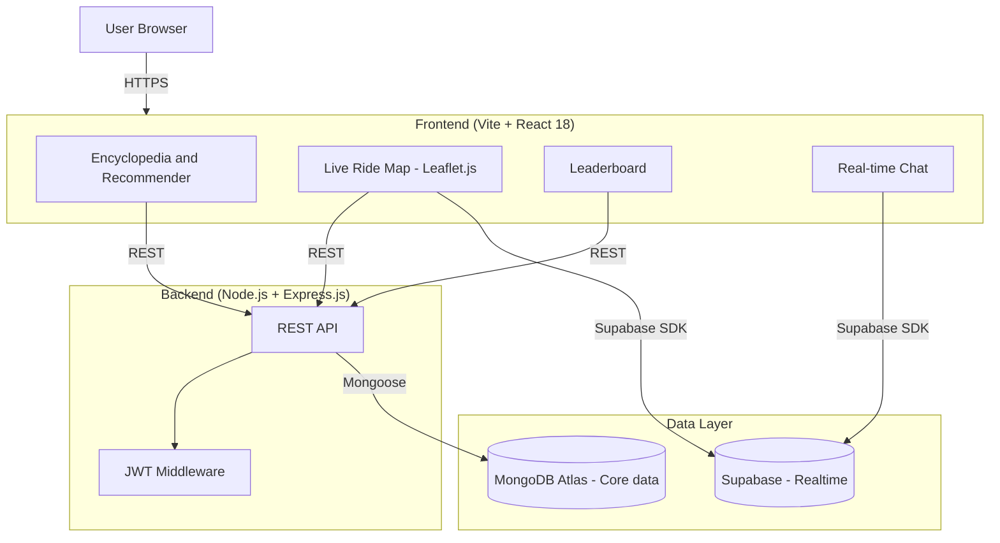

# 🚲 CycHigh — Cycling Encyclopedia & Community Platform

> A production-grade full-stack platform for cyclists — combining a curated encyclopedia of 120 bicycles with live ride tracking, competitive leaderboards, real-time chat, and a "Midnight Gold" design system.


---

## 📌 Overview

CycHigh is a full-stack cycling platform with two core pillars:

- **Encyclopedia** — A curated database of 120 bicycles across 25 brands with full technical specs, INR pricing, maintenance guides, and an intelligent 5-parameter recommendation engine.
- **Community** — A social platform where riders track live rides on an interactive map, compete on leaderboards, chat in real-time, and manage their profiles.

The backend is powered by Node.js/Express.js with MongoDB Atlas, and real-time features are handled by Supabase (migrating from Firebase).

---

## ✨ Features

### 📚 Encyclopedia
- Curated database of **120 bicycles across 25 brands** with complete technical specifications, INR pricing, maintenance guides, and upgrade recommendations
- **5-parameter recommendation engine** scoring cycles across skill level, terrain type, budget, riding purpose, and fitness goal — returns top 5 matches with percentage scores
- Side-by-side **comparison engine** with automated value-highlighting logic
- Client-side **PDF export** of recommendations and comparisons

### 🗺️ Live Ride Map
- Interactive map powered by **Leaflet.js** and React-Leaflet
- Real-time location presence tracking for active riders
- Route visualisation and ride history

### 🏆 Leaderboards
- Competitive ranking system across the community
- Sortable by distance, speed, and activity streaks

### 💬 Real-time Chat
- Live chat rooms per riding group or route
- Powered by Supabase real-time subscriptions

### 👤 User Profiles
- Full profile management with ride stats and activity feed
- Follower system and kudos

### 🔔 Notifications
- Real-time activity notifications
- Ride invites, kudos, and milestone alerts

### 🔐 Secure Authentication
- JWT-based auth with `bcryptjs` password hashing
- Rate limiting, CORS, and HTTP header protection via Helmet

---

## 🛠️ Tech Stack

| Layer | Technology |
|---|---|
| Frontend | React 18, Vite, Tailwind CSS, React Router DOM |
| Maps | Leaflet.js, React-Leaflet |
| Animations | Framer Motion |
| Charts | Recharts |
| Real-time / BaaS | Supabase JS SDK (migrating from Firebase) |
| Backend | Node.js, Express.js |
| Database | MongoDB Atlas, Mongoose ODM |
| Auth | JWT, bcryptjs |
| Security | Helmet, CORS, Express Rate Limit |
| File Uploads | Multer |

---

## 📁 Project Structure

```
cychigh/
├── backend/                  # Express.js REST API
│   ├── data/                 # Seed scripts — 120 bicycle records (JSON)
│   ├── models/               # Mongoose schemas (Bicycle, User, Ride, Review)
│   ├── routes/               # Express route handlers
│   └── server.js             # Entry point
│
├── frontend/                 # React 18 frontend
│   ├── src/
│   │   ├── components/       # Reusable UI components
│   │   ├── pages/            # Route-level pages
│   │   ├── hooks/            # Custom React hooks
│   │   └── utils/            # Recommendation algorithm, helpers
│   ├── index.html
│   └── vite.config.js
│
└── supabase/                 # Supabase config and migrations
```

---

## 🚀 Getting Started

### Prerequisites

- Node.js v16+
- MongoDB Atlas account (or local MongoDB)
- Supabase project (for real-time features)

### Installation

```bash
# Clone the repository
git clone https://github.com/pujit23/cychigh.git
cd cychigh
```

```bash
# Install backend dependencies
cd backend
npm install
```

```bash
# Install frontend dependencies
cd ../frontend
npm install
```

### Environment Variables

**Backend** — create `backend/.env`:

```env
PORT=5000
MONGO_URI=your_mongodb_atlas_connection_string
JWT_SECRET=your_jwt_secret_key
JWT_EXPIRES_IN=7d
```

**Frontend** — create `frontend/.env`:

```env
VITE_SUPABASE_URL=your_supabase_project_url
VITE_SUPABASE_ANON_KEY=your_supabase_anon_key
```

### Running Locally

```bash
# Terminal 1 — backend (http://localhost:5000)
cd backend
npm run dev

# Terminal 2 — frontend (http://localhost:5173)
cd frontend
npm run dev
```

### Seed the Database

```bash
# From /backend — imports all 120 bicycle records
npm run seed
```

---

## 🔌 API Reference

### Auth

| Method | Endpoint | Description |
|---|---|---|
| POST | `/api/auth/register` | Register new user |
| POST | `/api/auth/login` | Login, returns JWT |

### Bicycles (Encyclopedia)

| Method | Endpoint | Description |
|---|---|---|
| GET | `/api/bicycles` | Get all bicycles (filter, paginate) |
| GET | `/api/bicycles/:id` | Get single bicycle by ID |
| GET | `/api/bicycles/recommend` | Top 5 recommendations by params |
| GET | `/api/bicycles/compare` | Side-by-side comparison |

### Rides (Community)

| Method | Endpoint | Description |
|---|---|---|
| GET | `/api/rides` | Get all rides |
| POST | `/api/rides` | Log a new ride |
| GET | `/api/rides/:id` | Get ride by ID |

### Leaderboard

| Method | Endpoint | Description |
|---|---|---|
| GET | `/api/leaderboard` | Get ranked community list |

### Users

| Method | Endpoint | Description |
|---|---|---|
| GET | `/api/users/:id` | Get user profile |
| PUT | `/api/users/:id` | Update profile |

### Admin (JWT protected)

| Method | Endpoint | Description |
|---|---|---|
| POST | `/api/admin/bicycles` | Add new bicycle |
| PUT | `/api/admin/bicycles/:id` | Update bicycle record |
| DELETE | `/api/admin/bicycles/:id` | Delete bicycle |
| POST | `/api/admin/bicycles/bulk` | Bulk JSON import |

---

## 🧠 Recommendation Algorithm

The engine scores each bicycle across 5 parameters and returns a weighted match percentage:

```
Score = (w1 × skill_match)   +
        (w2 × terrain_match) +
        (w3 × budget_match)  +
        (w4 × purpose_match) +
        (w5 × fitness_match)
```

Budget and terrain carry higher default weights. Top 5 results are sorted by descending score and returned with percentage labels. Results can be exported as a PDF client-side.

---

## 🗺️ System Architecture



---

## 🔒 Security

- Passwords hashed with `bcryptjs` (salt rounds: 12)
- JWT tokens with configurable expiry
- Rate limiting via `express-rate-limit`
- HTTP headers secured with `Helmet`
- CORS configured for allowed origins only
- `.env` files excluded via `.gitignore`

---

## 📸 Screenshots

> *(Add screenshots — encyclopedia browse, recommendation results, comparison view, live map, leaderboard, chat)*

---

## 🛣️ Roadmap

- [ ] Complete Supabase migration for all real-time features
- [ ] Mobile app (React Native)
- [ ] Strava / Garmin ride import
- [ ] Group ride planning and invites
- [ ] User-submitted cycle reviews

---

## 👨‍💻 Author

**Pujit Balanthiran**  
[GitHub](https://github.com/pujit23) · [LinkedIn](https://linkedin.com/in/pujitbalanthiran) · pujitbalanthiran23@gmail.com

---

## 📄 License

This project is licensed under the MIT License.
